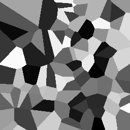

# Voronoi diagram
Creates Voronoi diagram using CUDA.

## Compiling
nvcc -arch=sm_35 -o Voronoi Voronoi2D.cu

## Execute

It creates a binary file named "Voronoi2D" which you can 
import as raw data for example to [Fiji](https://imagej.net/Fiji/Downloads).
Width and Height are 256,256 pixels and image type is 32-bit unsigned.

## Added VoronoiShared
It uses shared memory.
You can import the file "VoronoiShared"
